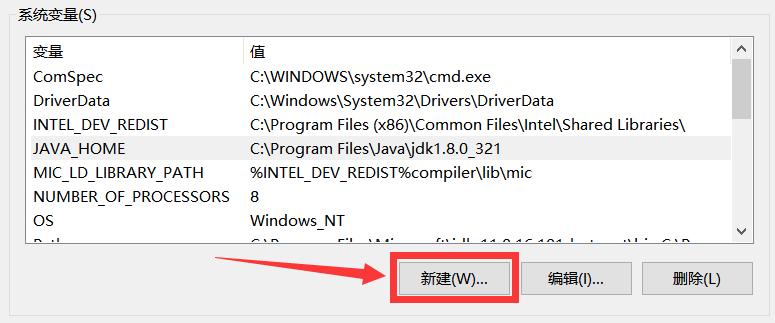

# MCreator使用指南

<!-- 编写日期：2023.1.12 -->

## 前言

Minecraft总销量过2亿份，月活跃用户超过1.5亿人。Minecraft已经成为全世界流行的游戏之一。Minecraft最初版本由Mojang AB使用Java开发并在PC上运行，是目前世界上最流行的游戏之一。

如此流行的根本原因之一就是模组(Mod，由Modification的前三个字母得名)的出现，现在快捷方便安装模组的方法归功于一类被成为ModLoader的特殊模组。目前主流的ModLoader为Forge、Fabric与Quilt(LiteLoader弃坑，Rift作者由于反混淆库原因加入Fabric开发组)。

MCreator是用于制作MC Java版模组、基岩版Add-Ons、数据包的开源软件，使用可视化界面或使用集成的代码编辑器。

MCreator是用于修改Minecraft的软件，不需要编程知识（模组生成器）。它使用起来非常简单，其概念也很容易学习。使用MCreator可以制作新的方块、物品、进度、现有方块的新类型、生物、生物群系、自定义维度和传送门、食物、工具、植物、机器、能源系统、武器，以及更多的东西。你可以使用Git集成，与你的朋友同时在同一个模组上工作。

通过MCreator，你可以制作各种不同的模组类型，包括自定义游戏中的叠加层、自定义机器、合成台、熔炉、新的游戏逻辑、结构、维度、工具组、武器，改变游戏的现有功能，等等。

MCreator为你提供了许多工具来规划、创建和编辑你的模组的资源。有了一个集成的材质编辑器，你可以直接从MCreator为你的模组制作材质。使用模板、过滤器和其他集成图像工具，你可以快速制作你心中的材质。你也可以从应用程序中制作和编辑动画。

MCreator捆绑了大量的工具，使模组创建更加容易。忘记技术细节，专注于模组创建和创意过程本身。包括材质制作器，动画编辑器，生物动画，声音管理器，以及更多。MCreator使您有可能将您的创造性在Minecraft中的想法变为现实。

MCreator为你提供 "所见即所得 "的体验。你可以简单地拖放项目和元素，以最自然的方式编辑你的模组。包括先进的UI编辑器来定义你的自定义机器的UI，合成台，熔炼机器，能源提取器，你来命名它！

MCreator包含一个先进的程序和事件系统，允许你定义复杂的动作，当用户在游戏内触发一个动作时发生。你可以将事件分配给一个特定的项目、方块、生物、维度，但你也可以分配由全局行动触发的全局事件，如实体与另一实体碰撞。

定义配方、掉落物和更多，就像你在游戏中制作的一样。使用过滤器在Minecraft庞大的物品列表中搜索。你可以导出配方图像，并在你的模组的描述和指南书中使用它们。

适合于初学者和高级用户。它的代码编辑器具有跳转到声明、自动完成、自动代码辅助和许多其他先进的IDE功能，你也可以使用MCreator进行基于代码的修改。它提供了对反编译代码和库代码的洞察力，包括在整个代码库中搜索。

用彩色高亮的调试控制台调试你的模组！MCreator与Gradle构建系统集成，因此MCreator工作区同时也是一个Gradle项目。在构建错误的情况下，MCreator将为你提供链接，跳转到错误的代码行和其他关于错误性质的有用见解。

在阅读本教程后，读者可以很轻易地使用MCreator来编写Minecraft模组。

### Q&A

#### 不会Java有影响吗

没有影响，MCreator会根据你的参数配置自动生成Java代码，如果对自动生成的代码不满意，也可自行修改，这一点会在靠后的章节说明。

#### 我可以使用Kotlin编写吗

暂时不行，在本教程编写的时间，MCreator社区还未有人制作允许使用Kotlin编写模组的插件，或许在未来会有类似插件出现。

#### 这本书可以让我熟练使用Java开发吗

很抱歉，不行，由于MCreator使用可视化界面来编写模组，初学者基本不会使用到手动修改Java代码的功能，所以学习Java开发不能依靠MCreator，还是需要自己的努力。

#### 硬件要求有哪些

内存空间大于4GB，64位Windows 10操作系统，物理内存大于6GB。网络速度建议百兆以上，建议准备加速工具。

#### 下载过慢怎么办

作者在本教程的Github仓库与Gitee仓库中上传了本教程所需的所有文件。

https://github.com/Grey-Wind/MCreatorUsageGuide

https://gitee.com/at-studio/MCreatorUsageGuide

<!-- 前言编写日期：2023.1.12

前言参考：

1.土球球撰写的《我的世界：Minecraft模组开发指南》

2.MC百科中MCreator的介绍 -->

## 目录

* 第一部分：准备开发
  * 配置开发环境
  * 下载MCreator
  * 创建第一个Forge模组(1.16.5)
* 第二部分：基础知识

### 第一部分：准备开发

#### 配置开发环境

在本教程撰写时，Java的最新正式版为Java 19，Java 20与Java 21早期构建也已经发布，但是只推荐下载Java 8与Java 16，Java 11视情况下载。

Java可在 `www.oracle.com/cn/java/technologies/downloads` 下载(当然，在 `jdk.java.net` 下载也是可行的)。

先使用Win 10搜索“环境变量”，打开“编辑系统环境变量”。

点击“环境变量”，打开环境变量窗口。

在下方系统变量处点击“新建”。

添加变量名为 `JAVA_HOME`。

变量值为安装JDK的路径，一般在 `C:\Program Files\Java\jdk1.8.0_321`，一般都在系统盘。

接着双击系统变量中的Path。

在新窗口中点击“新建”，输入 `％JAVA_HOME%\bin;`。注意！分号不能少。

紧接着，新建一个名为 `CLASSPATH`的系统变量，变量值为 `.`。

现在输入 `javac -version`，如果出现了Java版本即设置正常(注：在安装多个Java的情况下有可能显示的Java与你配置的不同)。

#### 下载MCreator

前往MCreator的官方网站(mcreator.net)下载最新版MCreator(本教程撰写时最新版为2022.3)，如果网速偏慢可以在本教程的Github或Gitee仓库中下载。本教程以Windows系统演示，Linux和Mac大致相同。

从本教程下载的MCreator为一个后缀名为7z的压缩文件，目前所有的模组生成器已经配全，将内部名为MCreator的文件夹解压至Program Files文件夹，由于是解压得来的，所以快捷方式需自行创建。

#### 创建第一个Forge模组(1.16.5)

##### 更换中文

运行MCreator，在偏好设置内选择中文，在仓库内下载的MCreator有中文帮助，应该为图片中的81%。

如果没有自动替换为中文需要重启MCreator。

##### 新建工作区

点击新建工作区按钮，弹出新建工作区窗口，默认选择新建Forge模组。接着，输入你想要的模组显示名称，极度不建议输入中文及中文字符，本教程输入 `Example`作为模组名称。大部分情况下，模组命名空间不建议修改，如果不喜欢默认的，可自行在创建模组前调整，创建模组后调整会导致识别为两个模组。接下来，调整模组生成器版本为1.16.5。选择文件夹，点击创建。

在创建完成后，MCreator会自行设置、导入Gradle项目。

构建失败通常为以下两种情况：

* 内存不够：建议内存空间大于5GB
* 网络环境差：找一些访问速度快的网络，也可采取辅助措施

在构建成功后，会自动切换至工作区界面。

初学者只需要知道几个按钮的作用：

* 模组元素：模组中所有元素的显示位置
* 资源：模组中材质、3D模型、音效等文件的显示位置

##### GUI介绍

最左侧两个按钮为创建(动态)材质。

在这两个按钮右侧的三个按钮是上传方块、物品、画(图标)材质。

材质导入右侧为导入ogg音效与nbt结构。

音效结构导入再向右就是导入3D模型按钮，共有3种，从左向右分别为Java，Json与OBJ+MTL，编者建议使用Json模型。

继续向右，为创建包按钮，有5种，从左向右分别为材料包、矿石包、工具包、盔甲包、木材包。这可以让你使用几次点击就能创建一整套方块与物品。

现在向最右侧看，这五个按钮分别为工作区设置；重新生成代码并构建；重新生成模组基本源文件并构建Gradle项目；启动游戏客户端；启动服务器与客户端；取消Gradle任务；构建导出模组。我们所熟知的模组版本、描述、Logo就是在工作区设置种修改(注意：基础设置除非十分熟悉模组开发，否则慎重修改)。外部API就类似于前置模组，高级设置本教程不会叙述(毕竟是针对初学者的)。

##### 小结

截止到这一步，第一个可以算是模组的项目就被成功构建了。

以下来介绍一下项目中的各类文件：

* src/main/java/：此目录中存放项目的Java代码
* src/main/resources/：此目录中存放项目的资源文件
* build.gradle：Gradle 的全局配置
* gradlew.bat：Windows 平台用于引导构建工具启动的文件
* gradlew：Linux/macOS 平台用于引导构建工具启动的文件
* gradle/：此目录中存放构建工具的核心文件
* *.mcreator：MCreator的启动文件

请读者在不熟练的情况下不要对文件有任何删改，正常在MCreator内编辑即可。

#### 创建第一个物品
